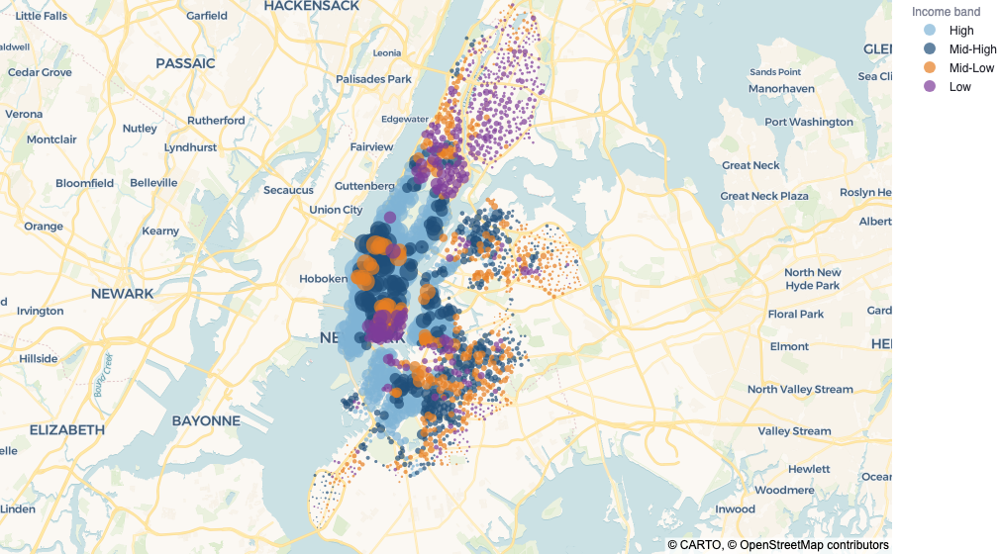

# Where Citi Bike Is Losing Value

**A neighborhood-level analysis of ridership gaps across New York's bike share, and what to do about them.**

Citi Bike ran 43.3 million trips across 2,164 stations in 2025, but the network is unevenly used. Stations in the lowest income band average 23 rides per day; stations in the highest average 114. This project combines a full year of trip records with census income, household density, subway access and car ownership to work out where the gap sits, what explains it, and what Citi Bike should do before its operating contract with New York City comes up for renewal in 2029.

**[Read the report](docs/report.md)** · **[Technical report](docs/technical_report.md)** · **[Live dashboard](https://citibikeexam-cbzpwj3bmkpkp2tq5efncv.streamlit.app/)** · PDF versions: [report](docs/CitiBike-Report.pdf), [technical](docs/CitiBike-Technical-Report.pdf)



## What the analysis found

- Four neighborhood variables (median household income, subway access, household density, car-free household share) explain 45% of the variation in station ridership across the network.
- The 273 low-income Bronx stations average 11 rides per day against a system average of 56, and 16 rides per day below what the regression predicts from their demographics alone. The gap survives a Poisson cross-check and is the clearest unexplained gap in the network.
- Supply is not the problem. Docks at low-income stations are used about a third as often as docks at high-income ones (0.81 rides per dock per day against 2.66), so building more of them would not close the gap.
- The low-income riders who do use the system ride like commuters: weekday-heavy, longer trips, and an 81% e-bike rate, the highest in the network. The product fits their needs. Cost and awareness are the most plausible barriers filtering other riders out.
- The report recommends a subsidized-membership pilot in the Bronx, e-bike prioritization at stations that are both low-income and far from the subway, redirecting planned dock investment toward demand-side action, and borough-level accountability in Citi Bike's monthly reporting. It also says plainly what the data cannot prove: members riding more does not show that membership causes more riding.

If those 273 Bronx stations reached the next band's average of 29 rides per day, that alone would add roughly 1.79 million rides per year with no new infrastructure.

## How it was built

The dashboard and every chart in the report read one dataset, built by a Python pipeline from five public sources: Citi Bike trip records and station feed, American Community Survey socioeconomics, MTA subway locations, and census tract boundaries. The [technical report](docs/technical_report.md) documents every step, the analytical decisions, and the robustness checks; [the data dictionary](docs/data_dictionary.md) describes every column.

### Repository structure

- `docs/` — the report, the technical report, figures, and the data dictionary
- `app.py` — Streamlit dashboard entry point
- `dashboard/` — dashboard tabs, data loader, theme
- `src/` — Python pipeline scripts, numbered by stage
- `data/raw/` — original source data (Citi Bike, ACS census, MTA subway, shapefiles)
- `data/processed/` — cleaned analysis-ready datasets

### Reproducing the pipeline

Scripts in `src/` are numbered by stage — run them in numerical order to rebuild every processed dataset from the raw sources.

| Stage | Purpose |
|-------|---------|
| `00_` | Inspect raw trip file structure |
| `10_`–`15_` | Build station metadata, census socioeconomics, tract lookup, subway proximity |
| `20_`–`22_` | Build station-day usage from raw trips; diagnose and approve station crosswalk |
| `30_`–`33_` | Build the master station-day table and analysis-ready subset |
| `40_`–`42_` | Build and enrich the station-level summary with income/poverty bands, borough, weekday/weekend metrics |
| `50_`–`51_` | Final cleanup — produce `station_summary_2025.csv` and `station_daily_2025.csv` |

Raw trip CSVs are not committed (too large). They are available from the Citi Bike public S3 bucket under `citibike-tripdata/2025/`. The final `station_summary_2025.csv` (2,164 rows, one per station) is committed and is what the dashboard and all report charts read.

### Running the dashboard locally

The deployed Streamlit instance linked above is the primary access path. To run it locally instead:

```bash
python -m venv .venv && source .venv/bin/activate
pip install -r requirements.txt
streamlit run app.py
```

## Who

A two-person exam project for EDI 3600 Digital Business Analysis at BI Norwegian Business School, spring 2026. The AI-use declarations at the end of each report describe how AI tools were used, and how every number and citation was verified independently of them.
