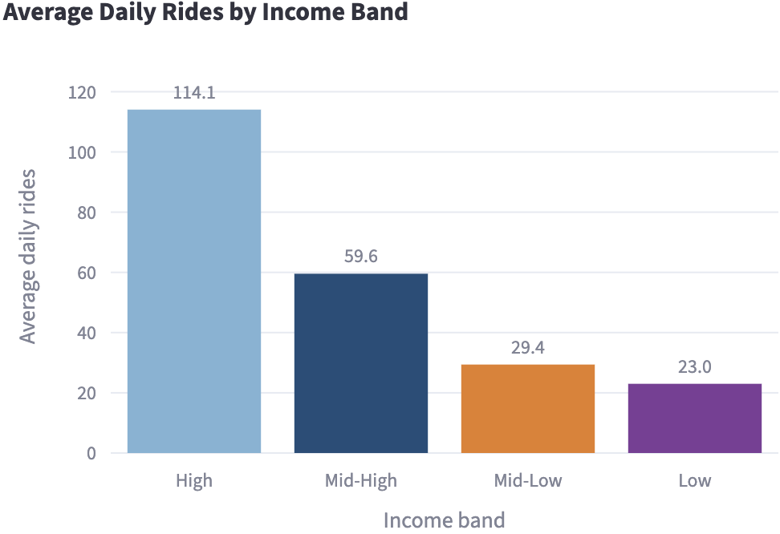
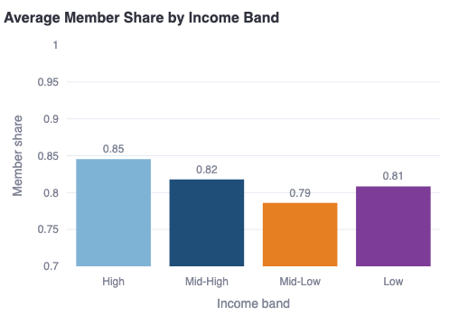
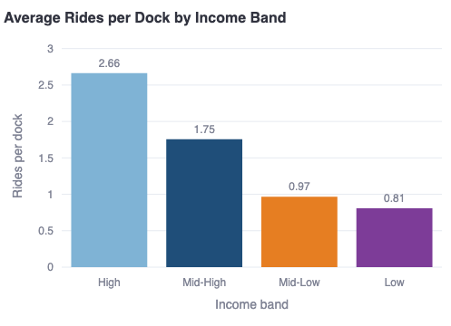
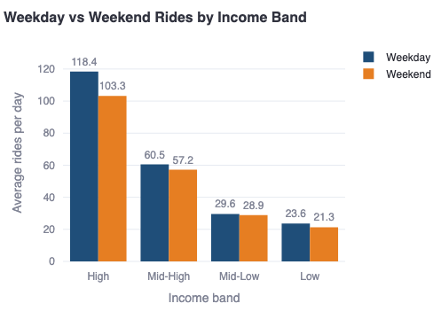
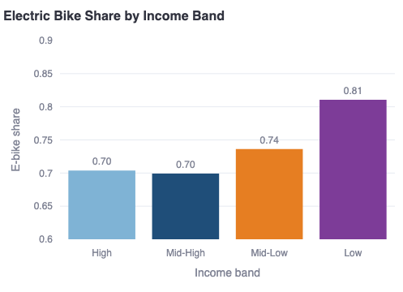
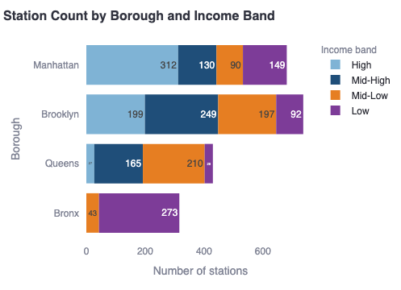
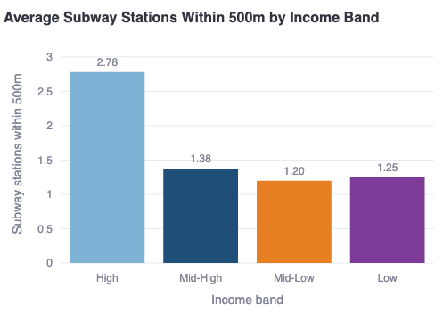
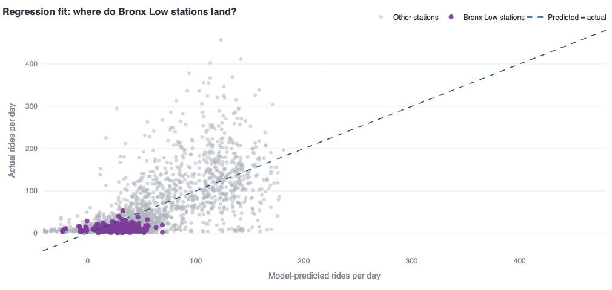

# Where Citi Bike Is Losing Value

### A Neighborhood-Level Analysis of Ridership Gaps and What to Do About Them

EDI 3600 Digital Business Analysis, BI Norwegian Business School, Spring 2026

*Dataset: Citi Bike NYC 2025, 43.3 million trips across 2,164 stations*

---

## Executive Summary

Citi Bike ran 43.3 million trips across 2,164 stations in 2025, but the network is unevenly used. Stations in the lowest income band average 23 rides per day; stations in the highest average 114. The gap is most extreme in the Bronx, where 86% of stations sit in low-income census tracts (small geographic areas the US Census uses to measure neighborhood income and demographics) and ride at roughly 11 rides per day. Citi Bike's operating contract with New York City is up for renewal in May 2029, and both the Independent Budget Office and the Comptroller's Office have said the next contract will be judged on outer-borough service and reach (NYC IBO, 2025; NYC Comptroller, 2023). Closing the gap before then is both a service improvement and a condition for keeping the current private, no-subsidy arrangement in place.

The analysis combines Citi Bike trip records with American Community Survey data, subway locations, and census tract boundaries across all 2,164 stations. Four neighborhood variables (median household income, subway access, household density, car-free household share) explain 45% of the variation in ridership across the network. Within that model, the 273 Bronx low-income stations average 11 rides per day, 16 fewer than the regression predicts from their demographics. The same check run across every borough and income band confirms Bronx Low is the clearest unexplained gap, not a Bronx-specific quirk or a demographic ceiling. Low-income riders who do use the service ride like commuters and choose e-bikes at an 81% rate, which suggests the product fits their needs but cost and awareness barriers are filtering riders out.

The report recommends four actions:

- **R1.** Expand subsidized membership uptake in low-income areas, starting with the Bronx, through direct partnerships with NYCHA and community organizations.
- **R2.** Prioritize electric bikes at stations that are both low-income and far from the subway, to better serve the riders already using them.
- **R3.** Redirect planned dock investment in low-income areas toward R1 and R2 until rides per dock rise from the current 0.81 above 1.5.
- **R4.** Build borough-level accountability into Citi Bike's monthly operating report, with explicit ridership targets for each borough and income band.

If the 273 Bronx low-income stations moved from 11 rides per day to the system-wide Mid-Low band average of 29, that alone would add approximately 1.79 million rides per year without new stations, docks, or infrastructure.

## 1. Business Problem

Citi Bike operates over 2,000 stations across New York City. In 2025, riders completed 43.3 million trips on the system. Despite this scale, a large part of the network is being underused.

Stations in lower-income neighborhoods average roughly one-fifth the ridership seen in wealthier parts of the city. This creates a practical problem for the company: infrastructure is being maintained and operated in areas where demand is low, while the neighborhood factors behind that demand gap have not been made visible in public reporting. Without a clear read on what drives the low numbers, Citi Bike cannot decide where to invest, who to reach out to, or what changes would bring more riders in.

The timing of this question also matters. Citi Bike's current operating contract with New York City expires in May 2029 (New York City Independent Budget Office [NYC IBO], 2025, p. 1). The Independent Budget Office and the Office of the New York City Comptroller (NYC Comptroller, 2023) have each published detailed reviews of the program ahead of the next contract, and both point to outer-borough service reliability and how many low-income riders the program reaches as the things the next contract will be judged on. This report treats the time before that contract as Citi Bike's opportunity: the outer-borough neighborhoods the City has flagged already have plenty of unused docks in place, so the improvements the next contract will require can be met mostly by getting more use out of stations that already exist, rather than building new ones.

Using trip records combined with census data, transit access, and station capacity, this report identifies which neighborhood factors are linked to low ridership, shows that the problem is not about station size, and ends with specific recommendations.

The business problem is this: ridership is significantly lower in lower-income parts of the network, Citi Bike does not have a clear picture of what is driving that gap, and the 2029 contract renewal makes understanding and addressing it urgent.

## 2. Research Question

This report looks at how neighborhood characteristics, including income, poverty rate, car-free household share, and subway access, relate to ridership and membership levels at Citi Bike stations. The goal is to identify which factors matter most and where the company should focus its efforts: the network itself, outreach programs, or how the product is offered. The City is working through a version of the same question ahead of the 2029 contract renewal (NYC IBO, 2025; NYC Comptroller, 2023), which makes the answer a practical business question for Citi Bike, not just an analytic one.

## 3. Data and Method

### 3.1 Data Sources

The analysis is based on five data sources combined into a single station-level dataset:

- **Citi Bike trip records (2025):** Full-year trip data covering all 12 months. Each trip record includes start station, date, whether the rider was a member or casual user, and the type of bike used (Citi Bike, 2025d).
- **Citi Bike station feed (GBFS):** Provides dock capacity and station coordinates for each station in the network (Citi Bike, 2025d).
- **American Community Survey (ACS 2024, 5-year estimates):** A large-scale US Census survey providing neighborhood-level figures for median household income, poverty rate, car-free household share, and household density. The 5-year version covers 2020-2024 and gives the most reliable local estimates available (U.S. Census Bureau, 2024a).
- **MTA Subway Stations:** Location data for all 496 subway and Staten Island Railway stations, used to measure how close each Citi Bike station is to the subway network (Metropolitan Transportation Authority, 2025).
- **Census tract shapefiles (TIGER/Line 2024):** Used to place each Citi Bike station inside the correct census tract, which is how every station inherits its neighborhood income, poverty, and car-free household values. Also used to calculate household density per square kilometer from each tract's land area (U.S. Census Bureau, 2024b).

### 3.2 Dataset

The final dataset contains one row per station, representing the full year 2025. Key variables include average daily rides, member share, dock capacity, income band, poverty band, subway distance, and borough. The dataset covers 2,164 stations and 43.3 million trips.

Stations were grouped into four income bands based on the median household income of their census tract:

| Band | Income range | Stations |
|------|-------------|----------|
| Low | Below $58,000 | 542 |
| Mid-Low | $58,000 to $86,000 | 540 |
| Mid-High | $86,000 to $136,000 | 544 |
| High | Above $136,000 | 538 |

The same approach was applied to poverty rate and car-free household share, creating four bands for each variable. Bands are built so that each one contains roughly the same number of stations (about 540 per band), which makes comparisons across bands fair and easy to read.

### 3.3 Limitations

The analysis is observational. It identifies patterns and associations across stations, but it cannot prove what causes those patterns. Income is linked to many other things at once, including neighborhood density, transit access, and infrastructure quality, and this analysis does not isolate any single cause. Where the report says something is likely driving the gap, that is our best reading of the data. The data shows a strong link between income and ridership, but a link is not the same as proof, and other factors we have not measured could also play a role.

Other limitations: census tract boundaries do not always match neighborhood boundaries precisely, and a station on the edge of a tract may not fully reflect the characteristics of its actual surroundings. The ACS data is a 5-year average (2020-2024) rather than a 2025 snapshot, so recent changes in neighborhood income will not be captured. Stations that could not be matched to complete census tract data were excluded from the analysis; most of these were in Jersey City and Hoboken rather than New York City proper. The technical report §3.5 shows the full reconciliation from raw trip stations to the 2,164 stations used here.

The analysis dataset, which combines Citi Bike trip records and station-feed data into one row per station, captures each station's dock capacity and annual ride volume but not historical data on broken bikes or broken docks. Citi Bike's GBFS feed publishes broken-bike and dock-status information in real time but does not store a historical record, and no comprehensive third-party archive of that feed exists for 2025. The Comptroller's 2023 review reports higher rates of broken bikes and less reliable service at the edges of the system, which overlap with the low-income stations examined here, so part of the under-use pattern may reflect service quality rather than demand alone (NYC Comptroller, 2023).

## 4. Analysis and Findings

### 4.1 The Ridership Gap

The most direct measure of the problem is average daily rides per station, broken down by income band.

Stations in the highest income band average 114 rides per day. Stations in the lowest income band average 23 rides per day. That is a fivefold difference. Mid-High stations average 60 rides per day and Mid-Low stations average 29 rides per day, showing a consistent step down as neighborhood income falls.

This is not a small gap. It is a consistent pattern affecting over 500 stations across the network.

Poverty rate shows the same pattern. Stations in the highest poverty areas average 29 rides per day, compared to 89 rides per day in the lowest poverty areas.

### 4.2 The Membership Gap

Members pay an annual or monthly fee and tend to ride more often than casual users, who pay per trip or per day. The share of rides taken by members at a station reflects both how committed those riders are and how much revenue the station generates per trip.

High income stations have an average member share of 85%. Low income stations have 81%, Mid-Low stations 79%. The Low band is slightly higher than Mid-Low, which is likely because low-income stations attract so few riders overall (23 per day) that the user base is almost entirely committed commuters, exactly the type of rider who signs up for a membership. Mid-Low stations have more mixed usage, which dilutes the member share. The differences are small in percentage terms but matter at scale. Across 43.3 million trips, a 4 percentage point gap in member share affects revenue per trip.

Lower member share means more riders at those stations are paying per trip or per day, which costs more over time than a membership. The upfront cost of an annual membership ($199-$239) is a plausible reason why lower-income riders may not have signed up (Citi Bike, 2025a). Research on bike-share equity has consistently identified cost and lack of awareness as top barriers to adoption in low-income communities (McNeil et al., 2017).

Citi Bike already operates a subsidized $5/month plan called Reduced Fare Bike Share, open to SNAP recipients and NYCHA residents (Citi Bike, 2025b). The low price sounds accessible, but who can sign up is tightly restricted. You need to already be enrolled in a specific government program to qualify. The Independent Budget Office reports that fewer than 40% of New York City residents with incomes under 200% of the federal poverty line receive SNAP benefits (NYC IBO, 2025, p. 15). So most low-income New Yorkers cannot enter the program at all. By comparison, Chicago's Divvy and Washington D.C.'s Capital Bikeshare offer low-income memberships at $5 per year, with looser rules for who can sign up (NYC IBO, 2025, p. 14). This leaves a meaningful pool of willing low-income riders outside the program, living near existing Citi Bike stations that the analysis in this report shows are under-used.

### 4.3 Supply Is Not the Problem

A common explanation for lower ridership in some areas is that stations are too small, with too few docks and not enough bikes available. This explanation does not hold up in the data.

Rides per dock measures how many rides each dock at a station generates on average per day. A high number means the station is busy relative to its size. A low number means the docks are sitting unused.

High income stations average 2.66 rides per dock per day. Low income stations average 0.81, with a median of just 0.53, meaning the typical low-income station's docks each get used roughly once every two days. Each dock at a low-income station gets used about a third as often as a dock at a high-income station. The docks are not the bottleneck.

This weakens the most expensive and obvious fix: building more docks or larger stations in low-income areas. On the daily-average data, the stations are not the bottleneck. Not enough people are choosing to use them.

### 4.4 How Existing Low-Income Riders Use the Service

Even though overall ridership is lower in low-income areas, the riders who do use Citi Bike there show a clear and consistent pattern. Three measures from the data all point in the same direction.

**Weekday vs weekend usage**

| Income band | Avg weekday rides | Avg weekend rides | Ratio |
|-------------|------------------|------------------|-------|
| High | 118.4 | 103.3 | 1.15 |
| Low | 23.6 | 21.3 | 1.11 |
| Mid-High | 60.5 | 57.2 | 1.06 |
| Mid-Low | 29.6 | 28.9 | 1.02 |

Mid-income stations show almost equal usage on weekdays and weekends, which suggests a mix of people commuting and people riding for leisure. High and Low income stations both show a stronger weekday-heavy usage, with ratios of 1.15 and 1.11. In low-income areas, the people who are already using Citi Bike show a pattern consistent with commuting: more weekday than weekend rides, rather than the even split seen at mid-income stations.

**Trip duration**

Low-income stations have the longest average trip duration in the system at 13.5 minutes, compared to 12.4 minutes at high-income stations. Riders in low-income areas are traveling further on each trip, which is consistent with using a bike to get to work or to a subway connection rather than taking a short recreational loop.

**Electric bike preference**

Low-income stations have the highest electric bike use in the system at 81%, compared to 70% at high-income stations. This makes sense for longer commutes where the motor assistance reduces effort and travel time.

These three signals, weekday-heavy usage, longer trips, and higher e-bike preference, all point to the same conclusion. The riders who do use Citi Bike in low-income areas are using it as a serious commuting tool. The product fits their needs. Something is stopping more people from signing up, and the patterns are consistent with what bike-share equity research has found in other cities, where cost and awareness are the most common barriers to adoption in lower-income communities (McNeil et al., 2017).

### 4.5 Geographic Concentration: The Bronx

The ridership gap is not spread evenly across all boroughs. It is concentrated in one place.

| Borough | High | Mid-High | Mid-Low | Low |
|---------|------|----------|---------|-----|
| Bronx | 0 | 0 | 43 | 273 |
| Brooklyn | 199 | 249 | 197 | 92 |
| Manhattan | 312 | 130 | 90 | 149 |
| Queens | 27 | 165 | 210 | 28 |

The Bronx has 316 stations. 273 of them (86%) are in the lowest income band. None are in the highest income band. Average daily rides at Bronx low-income stations are just 11 per day, against a system average of 56.

Brooklyn and Manhattan are mixed across income bands. Queens is mostly mid-range. The Bronx is almost entirely low income. This geographic concentration means that a targeted intervention in the Bronx addresses the largest share of the problem in the smallest and most defined area.

The map shows the same story geographically. Large, light-colored bubbles (high ridership, high income) cluster in central Manhattan and parts of Brooklyn. Small, purple bubbles (low ridership, low income) cluster in the Bronx and outer neighborhoods.

### 4.6 Transit Access as a Compounding Factor

Access to the subway network affects ridership. Stations near multiple subway lines benefit from natural foot traffic and from riders using Citi Bike as a short connection to or from the subway.

27.8% of all Citi Bike stations (602 out of 2,164) have no subway station within 500 meters. These stations tend to have lower ridership. High income stations average 2.78 subway stations within 500 meters. Low income stations average just 1.25.

This adds a second layer to the problem in certain parts of the network. Some stations face both low neighborhood income and limited subway access at the same time. These are the stations where both barriers stack on top of each other, and Recommendation 2 targets this overlap directly by prioritizing e-bikes at these stations.

### 4.7 Car-Free Households: Density Does Most of the Work

Car-free household share looks like a strong predictor of ridership on its own, but most of that apparent effect is density. Once density is held fixed, car-free share still adds a small but real contribution. Income remains the primary lens throughout this report. The rest of this section walks through how the data supports each of those three conclusions in turn.

Car-free household share, the percentage of households without a car, looks like a natural predictor of bike ridership. The assumption would be that people without cars are more likely to use bikes to get around. The data shows a more complicated pattern. The bands in the table below split stations into four equal-count groups based on their car-free share, the same way the income bands are built.

| Car-free band | Avg daily rides | Avg density (households/sqkm) |
|--------------|----------------|-------------------------------|
| Very High | 93.3 | 14,834 |
| High | 59.4 | 12,834 |
| Moderate | 46.2 | 10,397 |
| Low | 26.9 | 6,382 |

Stations in the highest car-free areas have the most rides, but the reason isn't that car-free households cycle more. The highest car-free areas in NYC are dense Manhattan neighborhoods, and density does two things at once: it brings lots of riders (more people, more trips), and it makes cars unnecessary (subway and walkable streets cover most needs). The same dense neighborhoods score high on both because density causes both. Car-free share is along for the ride. The Bronx makes this concrete. Bronx low-income tracts also have a high car-free share (0.74), but their density and subway access are low, and their ridership is low. If car-free households were really driving ridership, the Bronx would ride more. It doesn't.

A useful counter-check sits inside this dataset: across all 2,164 stations, income and car-free share are almost uncorrelated (r = −0.07). This rules out the simple reading that car-free share is just a stand-in for low income, meaning a variable that is only high in poor neighborhoods and therefore adds nothing on top of income. The relevant split is between dense, well-connected, low-car-ownership neighborhoods (Manhattan) and lower-density, less-connected, low-car-ownership neighborhoods (parts of the Bronx).

When the high car-free areas are broken down by density, the apparent connection between car-free households and ridership is driven by dense, high-income neighborhoods where car-free status reflects urban living, not economic need. Income is the more reliable indicator of where the real problem is. This is why income band is used as the primary lens throughout this report, rather than car-free household share.

Section 5.1 puts all the neighborhood variables into one regression together, so each one is tested while holding the others fixed. In that setting, car-free household share still adds real information about ridership on top of income, density, and subway access. The effect is smaller than the simple comparison above suggests. Car-free areas in NYC tend to be dense Manhattan neighborhoods where people already ride a lot, so some of what looks like a connection to car-free households is really driven by density. But it is not zero. Income stays the primary lens in this report because it maps most directly to the subsidy-affordability argument. Car-free share is kept in the regression because it adds information that income on its own does not capture.

## 5. Prediction: What Happens Next

The Bronx low-income stations are used as a concrete case here because they represent the most clearly defined part of the problem: 273 stations, geographically concentrated, with a measurable gap and no new infrastructure required to test any intervention.

### 5.1 What Drives Ridership: Regression Validation

To test whether the patterns found in the band analysis hold up under a different method, we ran a regression across all 2,164 stations. A regression is a statistical method that estimates how much each factor contributes to ridership when all four are tested at the same time, rather than one by one. The four neighborhood variables used are median household income, number of subway stations within 500 meters, household density, and the share of car-free households in the tract (see Section 4.7). The method is a standard linear regression on average daily rides, with a second statistical test run to confirm the results hold (technical report §5). Poverty rate was not added as a fifth variable because poverty and income move together so closely in this dataset (r = -0.70) that including both would be redundant; income carries the same signal. Together these four variables explain 45% of the variation in average daily ridership across the network (R² = 0.45). All four matter. A $10,000 increase in median income adds 6.1 rides per day. One extra subway station within 500 meters adds 1.7 rides per day. An increase of 1,000 households per square kilometer adds 1.6 rides per day. A 10 percentage-point increase in the share of car-free households in a tract adds 12.5 rides per day. Each variable is adding something distinct: standard overlap checks confirm none of the four is simply measuring the same thing as another.

The regression confirms two findings from the band analysis. First, income is still a strong driver, and the share of car-free households adds real information on top of income. That makes sense: the New York neighborhoods with the highest car-free shares tend to be places where people already have strong subway access and walkable streets. Second, the model overpredicts ridership for the 273 Bronx low-income stations. Based on their income, subway access, density, and car-free share (0.74 at Bronx low-income stations versus 0.66 citywide), the model expects roughly 27 rides per day. The actual average is 11. That leaves a 16-ride gap per station that none of these neighborhood variables can explain. Including car-free share widens this gap rather than closing it. Because the Bronx runs well above the citywide car-free average, the regression expects these stations to ride more, not less. The gap sits outside what these four variables can explain. Cost, awareness, and service quality are the most plausible explanations. The regression cannot see those barriers directly, but it shows that the neighborhood story is not the whole story.

The same check was run for every borough and income-band combination. Bronx Low is the clearest gap in the network. Queens Mid-Low (210 stations averaging 13 rides per day) is the closest comparison in raw volume. But it matches its prediction almost exactly: the model says 13, and Queens Mid-Low delivers 13. There is no unexplained gap at those stations for a membership or awareness program to close. Other outer-borough Low and Mid-Low groups also ride below what the model predicts, but the gap is smaller than in the Bronx. The regression was also re-fit using a Poisson model as a second test, and Bronx Low still shows the largest gap between predicted and actual rides. The full per-group table and the Poisson check are in the technical report §5.

Performance is not uniform across the 273 Bronx Low stations. A small subset runs at roughly one ride per dock per day, more than double the 0.45 average across the rest of the group. These stations sit on the borough's main commercial and commuter corridors (Grand Concourse, Fordham Road, 3rd Avenue, Arthur Avenue) rather than in the higher-income or best subway-connected tracts. The reading is that Bronx Low docks can support ridership when local commuter or commercial activity is present, so cost and awareness barriers are the most plausible explanation for the gap at the remaining stations, though service quality (noted in §3.3) cannot be fully ruled out from this data alone.

### 5.2 If Citi Bike Does Nothing

The current pattern is stable. Without any action, the ridership gap between income bands will remain. At the current rate of 11 rides per station per day, the 273 Bronx stations in low-income tracts run at approximately 1.10 million rides per year. These stations have running costs (maintenance, bike rebalancing, customer service) regardless of how many people use them. When ridership is this low, those costs are not being recovered.

The risk is not just missed revenue. Citi Bike's current contract with New York City expires in May 2029. Both the Independent Budget Office and the Comptroller's Office have said the next contract is the moment to rethink the program's pricing, how it is run, and outer-borough service (NYC IBO, 2025, pp. 1–4; NYC Comptroller, 2023). If outer-borough stations are still under-used when that decision comes up, the case for continuing today's private, no-subsidy arrangement gets harder to make. Closing the gap before 2029, especially by getting more use out of docks that already exist in low-income outer-borough areas, is both a service improvement and a reason for the City to keep the current arrangement in place.

### 5.3 If Citi Bike Addresses the Demand Problem

If the 273 Bronx low-income stations moved from 11 rides per day to 29, the system-wide Mid-Low band average, their annual ride count would rise from roughly 1.10 million to 2.89 million. That is an increase of roughly 1.79 million rides per year. The formula is simple: 273 stations times the daily gap (29 minus 11), times 365 days. It assumes Bronx stations could eventually match system-wide Mid-Low performance. Getting there will be slow because the Bronx has fewer subway links and fewer bike lanes.

This does not require building new stations or adding docks. It requires increasing the number of people choosing to use stations that already exist and can handle more rides.

The most plausible intervention to test against this gap is a targeted subsidized-membership pilot. Citi Bike already offers a low-income membership for $5 per month (Citi Bike, 2025b). Stations with higher member share consistently show higher ridership across all income bands. The membership gap in section 4.2 suggests the upfront cost of a full-price membership is filtering out potential riders. Evidence from Boston shows that introducing an income-eligible membership program alongside station expansion increased overall bikeshare use, though the gap between higher and lower-income neighborhoods narrowed only modestly (Soto et al., 2021). Higher member share does not prove that membership causes higher ridership: frequent riders may simply be more likely to sign up. Even so, subsidized membership is the strongest candidate intervention, and the most cost-effective tool available since the infrastructure already exists.

## 6. Recommendations

### Recommendation 1: Expand subsidized membership uptake in low-income areas, starting with the Bronx

The data identifies the 273 Bronx stations in the lowest income band as the highest-priority area for intervention. These stations currently average 11 rides per day. The system average is 56. The existing $5/month low-income membership program is the most direct tool available to close that gap, but the program only works if people know about it and can sign up easily. This recommendation does not require new infrastructure or equipment. The main investment is outreach effort and making the sign-up process easier for eligible residents.

The Bronx cluster is the right place to pilot this approach. It has the clearest unexplained ridership gap in the network, 273 stations in a geographically concentrated area, and does not require new stations or docks. If the pilot moves member share and ride volumes at those stations, the same approach can extend to other low-income clusters.

Recommended actions:
- Shorten the path from eligibility to activation. The $5/month program is gated to NYCHA residents, SNAP recipients, and other documented groups (Citi Bike, 2025b), so one bottleneck is how many eligible residents complete sign-up. Focus on reducing the steps between "I qualify" and "I have a membership".
- Partner with NYCHA, Bronx community organizations, and large employers to promote the program directly to eligible residents.
- Track two KPIs: member share at Bronx low-income stations and total new subsidized memberships activated in the Bronx. The R1 panel of the dashboard shows the current baseline for this group of stations and the specific locations in scope.
- The business case: reaching Mid-Low band ridership levels at these 273 stations represents approximately 1.79 million additional rides per year with no new infrastructure.

This action also matches something the City has already asked for. The Comptroller's 2023 review recommended that the next contract require the operator to check income eligibility directly, rather than requiring applicants to be SNAP recipients first, because most low-income New Yorkers are not enrolled in SNAP (NYC Comptroller, 2023, Recommendation 4). R1 is Citi Bike's version of the same move: running eligibility checks internally would expand the pool of riders who can sign up for Reduced Fare, raise use of stations that are currently under-used, and let Citi Bike enter the 2029 contract talks having already acted on a specific City recommendation.

### Recommendation 2: Prioritize electric bikes at stations that are both low-income and far from the subway

The data shows that riders at low-income stations already choose electric bikes at a higher rate than anywhere else in the system (81%). These same stations also have fewer subway options nearby. For riders using Citi Bike to commute in areas without good subway access, electric bikes extend the practical commuting range beyond what is feasible on a classic bike, making more destinations reachable. This recommendation does not require buying new bikes. It means prioritising where existing e-bikes are sent during daily rebalancing operations that Citi Bike already carries out.

E-bike surcharges are also Citi Bike's single largest revenue line: $96.19 million in 2025 year-to-date through December (Citi Bike, 2025c). Directing more e-bikes to stations where riders already prefer them is a better use of existing fleet capacity, not a new cost.

Recommended actions:
- Identify stations that are both in the Low income band and more than 500 meters from any subway station. Based on the current dataset, this overlap represents a specific and manageable set of stations.
- Prioritize e-bike availability at those stations in daily fleet management decisions.
- Frame the action as fleet alignment with revealed preference, not a demand multiplier. A specific ridership uplift cannot be estimated from this dataset (see technical report §5), so R2 should be judged on whether it serves existing riders better, not on a predicted percentage increase. The R2 panel of the dashboard lists the specific stations in scope.
- More e-bikes at lower-use stations will require active rebalancing so bikes do not pile up or run out during commute windows. Rebalancing at this scale is already routine: Citi Bike performed 52,444 rebalancing moves in December 2025 alone, averaging 1,691 per day (Citi Bike, 2025c), so this is a reallocation of existing work, not a new operational burden.

### Recommendation 3: Redirect planned dock investment toward demand-side action

Rides per dock at low-income stations averages 0.81, with a median of 0.53. That is about a third of the rate at high-income stations (2.66). Building more docks or larger stations in low-income areas before demand grows would increase operating costs without increasing ridership. This recommendation is about where money already planned for dock expansion should go instead, not about finding new budget.

Any dock expansion planned for low-income areas should be redirected to Recommendations 1 and 2 instead. Dock expansion in the Bronx should be reconsidered once rides per dock at those stations consistently exceeds 1.5. That is roughly double the current Low-band average of 0.81, which would indicate demand has genuinely shifted rather than fluctuated slightly around the current baseline.

### Recommendation 4: Build borough-level accountability into performance reporting

The borough-income breakdown in this analysis shows that the Bronx, Queens, Brooklyn, and Manhattan face very different patterns. The Bronx is almost entirely low-income. Queens is mostly mid-range. Manhattan and Brooklyn are mixed. A single system-wide ridership target treats all of these the same, which makes it easy for the Bronx problem to be averaged out.

Citi Bike already files monthly operating reports with the NYC Department of Transportation covering ridership, fleet, customer service, and twelve service-level agreements (Citi Bike, 2025c). The reporting pipeline exists. What is missing is a breakdown of ridership by borough and income band within that report.

Recommended action: Add borough and income-band ridership cuts to the existing monthly operating report, with explicit targets for each borough-band combination. The immediate target for Bronx low-income stations is 29 rides per day, matching the Mid-Low band. The R4 panel of the dashboard shows the borough and income band breakdown that makes the gap visible, rather than averaging it into one system-wide number.

This action also matches something the City has already asked for. The Comptroller's 2023 review argued that the current monthly operating reports "aggregate system performance over a 30-day period, obscuring individual days or hours where issues occurred" and recommended that the next contract require Citi Bike to publish more detailed performance data publicly (NYC Comptroller, 2023, Recommendation 5). Adding borough and income-band cuts to the existing monthly report is the smallest version of that recommendation. Publishing these cuts before the next contract is negotiated lets Citi Bike enter the talks having already delivered the kind of reporting the City has specifically asked for.

## 7. Responsibility, Sustainability, and Wider Impact

The findings in this report are framed as a business problem. But the same data raises questions that go beyond profit. This section looks at those broader dimensions.

We look at the same ridership pattern through four lenses below, because each framework tests it against a different standard: Sustainability (SusAF) across five dimensions of long-term impact, Digital Responsibility (CDR) on how data-driven decisions affect the people behind the numbers, the Ethical Navigation Wheel on whether the recommendations survive six ethical tests at once, and Circular Economy on whether the actions get more out of existing assets rather than building new ones. Some themes recur across lenses; that recurrence is part of the test.

### 7.1 Sustainability

The Sustainability Awareness Framework (SusAF) looks at sustainability across five dimensions: environmental, social, economic, individual, and technical (Porras et al., 2021). The ridership gap in this report cuts across all five.

Citi Bike performs well on environmental metrics in aggregate. Using a methodology from the 2012 MTA Sustainability Report, the company's own operating reports estimate that Citi Bike avoided 1.55 million pounds of carbon emissions in December 2025 alone (Citi Bike, 2025c). With 43.3 million trips across the full year, the environmental benefit is real and operator-reported, not assumed: reduced emissions, less traffic, and less pressure on the subway network.

But the sustainability benefit is unevenly spread. The stations generating the most trips are in high-income, well-connected neighborhoods. Low-income neighborhoods, which tend to have more traffic pollution and less green space, are generating far fewer trips from the same network. A more evenly used network would deliver greater environmental and social benefit across the city, not just in areas that already have good transport options. Closing the ridership gap is therefore not only a revenue opportunity. It is a way of making the environmental and social value of the network more equitable, which is the economic sustainability dimension as well.

There is also an individual dimension. For riders in low-income areas, access to a reliable, affordable bike-share service can reduce commute times, improve physical health through regular cycling, and give people more control over how they get around. The data shows these riders already use Citi Bike as a commuting tool; expanding access through subsidized membership would extend those benefits to more individuals.

The technical dimension concerns whether the system itself can be maintained and adapted over time. Citi Bike's infrastructure already exists in low-income areas, and the analysis shows it has spare capacity. The recommendations in this report do not require building new technical systems; they require making better use of existing ones. However, as e-bike usage increases at these stations, the company will need to make sure that its fleet management, battery logistics, and rebalancing operations can handle the shift without creating new maintenance problems. Across the five dimensions, the ridership gap is more than a financial problem. It touches environmental access, social inclusion, individual wellbeing, and the system's long-term resilience.

### 7.2 Digital Responsibility

This analysis is built on data about how people move through the city. Trip records, station usage, and geographic data are combined to find patterns at the neighborhood level. The analysis uses aggregated, anonymised data and does not track individual riders. The recommendations are aimed at changing how Citi Bike allocates its resources, not at identifying or monitoring specific people.

Any company using data at this scale has a responsibility to be transparent about what is collected, how it is used, and who has access to it. There is also a harder question embedded in the recommendations themselves. Using income-band data to guide resource allocation is a form of data-driven decision-making. These approaches carry a risk of optimizing for what is measurable, such as trip volume and dock utilization, rather than genuine access outcomes. Citi Bike should make sure that acting on this analysis does not lead to outreach that targets the easiest conversions while leaving the most underserved stations unchanged. The goal is not to improve average metrics; it is to close the gap at the bottom of the distribution.

As the company uses data more actively to guide outreach and fleet decisions, it should keep data use aligned with its stated policies and with what riders would reasonably expect.

The Corporate Digital Responsibility (CDR) framework (Wade, 2020) provides a structured way to assess these issues. Three of the seven principles in the CDR Manifesto (Corporate Digital Responsibility Initiative, n.d.) are directly relevant here. Principle 1 (Purpose and Trust) applies because Citi Bike's use of neighborhood income data to guide resource allocation must be transparent; riders and communities should be able to see why certain stations get more attention than others. Principle 2 (Fair and Equitable Access for All) applies because the ridership gap means the service is not reaching the neighborhoods that could benefit from it most. That is exactly the kind of access gap this principle is meant to flag. Principle 4 (Consider Economic and Societal Impact) applies because acting on the analysis in this report means using data not just to optimize revenue, but to distribute access more fairly across the city.

### 7.3 Ethical Considerations

The Ethical Navigation Wheel (Kvalnes & Øverenget, 2012) asks decision-makers to weigh a choice across six areas at once: law, identity, morality, reputation, economy, and ethics. Applied to the recommendations in this report:

**Law: Is it legal?** Using census data and trip records for internal planning raises no legal concerns. Targeting outreach by neighborhood income is a standard marketing and public affairs practice.

**Identity: Is it in accordance with Citi Bike's values?** Citi Bike already runs a $5/month low-income membership (Citi Bike, 2025b), which signals that affordability sits inside the company's stated values. Acting on the findings in this report extends that position rather than breaking from it.

**Morality: Is it right?** The company already runs a reduced-fare program and operates infrastructure in the areas most affected by the gap. The recommendations in this report do not ask Citi Bike to do something new. They ask it to use what already exists more equitably. When a company has both the data showing an inequality and the tools to address it, choosing not to act is itself a moral choice. Acting is the right thing to do.

**Reputation: Does it affect goodwill?** Citi Bike operates under a franchise agreement with New York City, which means it acts more like a public service than a purely private company. Visible action on the Bronx gap strengthens the company's standing with the city, community organizations, and underserved residents. Visible inaction weakens it, especially once an analysis like this is on the record.

**Economy: Is it in accordance with business objectives?** The recommended actions grow ridership without new infrastructure spending. Reaching Mid-Low band performance at the 273 Bronx low-income stations adds roughly 1.79 million rides per year, which supports both revenue targets and the business case for existing dock investment.

**Ethics: Can it be justified?** A reasonable person reading this analysis would expect a company that already runs a low-income membership and receives public support to act once the data makes the gap visible. These recommendations are ones we would be comfortable defending in front of the city, community organizations, and Citi Bike's own customers.

### 7.4 Circular Economy

Bike share is a practical example of the circular economy (Kirchherr et al., 2017). Instead of everyone buying their own bike and eventually throwing it out, the system lets many people share the same maintained fleet. This reduces how many bikes need to be made and cuts the waste that comes from individual ownership.

The recommendations in this report fit naturally within this logic. Rather than recommending that Citi Bike build more stations or buy more bikes, the core recommendation is to get more out of what already exists. The infrastructure is there. The docks are underused. The e-bikes are preferred by the riders who do show up. The circular economy argument here is simple: get more value out of existing assets before spending on new ones. That is more resource-efficient, more cost-effective, and more consistent with a sustainable business model.

The circular economy logic also extends to the e-bikes specifically. E-bikes carry a battery lifecycle question: batteries degrade over time, need replacing, and create a waste problem if not managed carefully. As the recommendation to prioritize e-bikes at underserved stations would increase how intensively those bikes are used, Citi Bike should consider whether its maintenance and end-of-life processes for e-bike batteries are aligned with circular economy principles.

## 8. Conclusion

The analysis of 43.3 million Citi Bike trips across 2,164 stations in 2025 shows a clear pattern: stations in low-income areas average 23 rides per day against 114 in high-income areas, a fivefold gap. This gap is most concentrated in the Bronx, where 86% of stations fall in the lowest income band and average just 11 rides per day.

Of the four neighborhood characteristics examined, median household income is the strongest single predictor of lower ridership. Transit access compounds the effect at the stations furthest from the subway. Poverty rate shows a similar pattern to income. Car-free household share looks like a predictor of higher ridership on its own, but most of that apparent effect is really density: the dense Manhattan neighborhoods that score highest on car-free share are also the ones with the highest ridership, for the same underlying reason (Section 4.7). Once income, density, and subway access are all in the regression at the same time, car-free share still adds real information on top of them. In the Bronx, car-free share is higher than the city average (0.74 versus 0.66), so the regression actually expects those stations to ride more than they do. The gap between what the model expects and what actually happens gets wider when car-free share is included, not narrower.

The data shows this is not a supply problem: the infrastructure in low-income areas is underused, with each dock generating only about half a ride per day on average (median 0.53). The riders who do use Citi Bike in low-income areas ride like commuters: weekday-heavy, longer trips, and a strong preference for e-bikes. This suggests the service fits their needs. Fewer people are signing up than the usage pattern would predict. Cost and awareness are the most plausible explanations, consistent with bike-share equity research in other U.S. cities (McNeil et al., 2017).

Closing this gap does not require new infrastructure. It requires making the existing $5/month membership easier to access, ensuring e-bikes are consistently available at the stations where demand for them is highest, and building borough-level accountability into the company's regular performance reporting. If the 273 Bronx low-income stations reached Mid-Low band ridership levels, annual rides from those stations alone would increase by approximately 1.79 million, with no new docks built.

## References

Citi Bike. (2025a). *Citi Bike membership plans and pricing*. https://citibikenyc.com/pricing

Citi Bike. (2025b). *Reduced Fare Bikeshare*. https://citibikenyc.com/community-programs/reducedfare

Citi Bike. (2025c). *December 2025 monthly report*. https://citibikenyc.com/system-data/operating-reports

Citi Bike. (2025d). *System data: Trip history and station feed* [Data set]. https://citibikenyc.com/system-data

Corporate Digital Responsibility Initiative. (n.d.). *CDR Manifesto: Seven principles of Corporate Digital Responsibility*. https://corporatedigitalresponsibility.net/cdr-manifesto-english

Kirchherr, J., Reike, D., & Hekkert, M. (2017). Conceptualizing the circular economy: An analysis of 114 definitions. *Resources, Conservation and Recycling, 127*, 221–232. https://doi.org/10.1016/j.resconrec.2017.09.005

Kvalnes, Ø., & Øverenget, E. (2012). Ethical navigation in leadership training. *Etikk i praksis - Nordic Journal of Applied Ethics, 6*(1), 58-71. https://www.ntnu.no/ojs/index.php/etikk_i_praksis/article/view/1778

McNeil, N., Dill, J., MacArthur, J., Broach, J., & Howland, S. (2017). *Breaking Barriers to Bike Share: Insights from Residents of Traditionally Underserved Neighborhoods.* Portland State University, Transportation Research and Education Center (TREC). https://doi.org/10.15760/trec.176

Metropolitan Transportation Authority. (2025). *MTA subway stations* [Data set]. https://data.ny.gov/Transportation/MTA-Subway-Stations/39hk-dx4f

New York City Independent Budget Office. (2025, November). *Citi Bike: Lessons for the future of New York City's bike share*. https://www.ibo.nyc.gov/assets/ibo/downloads/pdf/infrastructure/2025/2025-november-citi-bike-lessons-for-the-future-of-nycs-bike-share.pdf

Office of the New York City Comptroller. (2023, November 15). *Riding forward: Overhauling Citi Bike's contract for better, more equitable service*. https://comptroller.nyc.gov/reports/riding-forward-overhauling-citi-bikes-contract-for-better-more-equitable-service/

Porras, J., Venters, C. C., Penzenstadler, B., Duboc, L., Betz, S., Seyff, N., Heshmatisafa, S., & Oyedeji, S. (2021). How could we have known? Anticipating sustainability effects of a software product. In X. Wang, A. Martini, A. Nguyen-Duc, & V. Stray (Eds.), *Software Business: 12th International Conference, ICSOB 2021*. Springer. https://doi.org/10.1007/978-3-030-91983-2_2

Soto, M. J., Vercammen, K. A., Dunn, C. G., Franckle, R. L., & Bleich, S. N. (2021). Changes in equity of bikeshare access and use following implementation of income-eligible membership program & system expansion in Greater Boston. *Journal of Transport & Health, 21*, 101053. https://doi.org/10.1016/j.jth.2021.101053

U.S. Census Bureau. (2024a). *American Community Survey 5-year estimates, 2020-2024* [Data set]. https://www.census.gov/data/developers/data-sets/acs-5year.html

U.S. Census Bureau. (2024b). *TIGER/Line shapefiles: Census tracts, New York State, 2024* [Data set]. https://www.census.gov/geographies/mapping-files/time-series/geo/tiger-line-file.2024.html

Wade, M. (2020). *Corporate responsibility in the digital era*. MIT Sloan Management Review. https://sloanreview.mit.edu/article/corporate-responsibility-in-the-digital-era/

## Appendix: Declaration of AI Use

This declaration covers AI use on the CitiBike report. AI use on the data pipeline and the technical report is documented in the Use of AI declaration at the end of the technical report.

**AI tools that have been used in the work on assignment/exam:**

- Claude (Anthropic, Opus 4.7)
- Codex (OpenAI, GPT-5.5)

**Purpose of AI use:**

We have used AI while undertaking our assignment in the following ways:

- To develop research questions on the topic - No
- To generate ideas - Yes
- To create an outline of the topic - Yes
- To explain concepts - Yes
- To support our use of language - Yes
- To organise data - No (covered in the technical report's declaration)
- To analyse data - No (covered in the technical report's declaration)
- To visualise data - No (covered in the technical report's declaration)

**In other ways, as described below:**

AI's main value here was in pressure-testing our analysis, not writing it. The conclusions, framework applications, and recommendations are our own. AI helped us by playing devil's advocate, pointing out where an argument was weaker than we thought, asking what a critical reader would push back on, and checking whether each of the four required frameworks (SusAF, CDR, Ethical Navigation Wheel, Circular Economy) actually connected to our findings rather than being applied superficially. It also helped us keep the voice consistent across the report (Citi Bike as the audience throughout, plain English, no jargon), which is harder than it sounds when you have been staring at the same text for too long. The tighter feedback loop pushed us to defend our reasoning out loud, which made gaps easier to see.

We worked with two AI systems in parallel: Claude (Anthropic, Opus 4.7) as the primary writing partner, and Codex (OpenAI, GPT-5.5) as a secondary reviewer working in a separate session with no shared context. Single AI systems can hallucinate or commit confidently to a wrong reading of a finding or a framework. Running substantive sections through both partners separately let each AI's output be challenged by the other: where they agreed, the argument was likely sound; where they disagreed, we knew we had not yet thought it through. The result was a more nuanced view than either system would have produced alone, and a much lower chance of an unchallenged AI mistake making it into the report. We kept a persistent file-based memory across sessions for our writing standard, our framing decisions, and our citation verification log, so each session continued from the previous one without re-explaining context. For larger pieces of work we followed a structured workflow of brainstorming, written spec, written plan, then execution, which forced us to commit to an approach before writing rather than discovering it along the way.

Every number in this report was verified against the processed dataset. Every citation was confirmed against the original source before being kept: academic citations against publisher records or DOI redirects, framework citations against the EDI 3600 lecturer's class slides, and the IBO and Comptroller citations against the source PDFs. AI was unreliable for factual claims and references, so AI-suggested citations were treated as unverified until checked independently. We are responsible for everything in this report.
